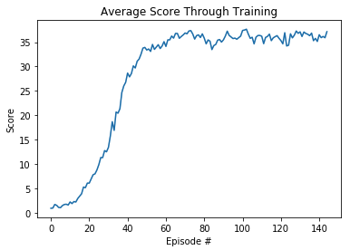

[image1]: https://user-images.githubusercontent.com/10624937/43851024-320ba930-9aff-11e8-8493-ee547c6af349.gif "Trained Agent"
[image2]: https://user-images.githubusercontent.com/10624937/43851646-d899bf20-9b00-11e8-858c-29b5c2c94ccc.png "Crawler"

# Project 2: Continuous Control Report
In this project we solve the [Reacher](https://github.com/Unity-Technologies/ml-agents/blob/master/docs/Learning-Environment-Examples.md#reacher) environment. using a DDPG Agent. The agent moves a double-jointed arm to target locations.

![Trained Agent][image1]

## Learning Algorithm

#### An overview

To solve this environment we used DDPG which is a form of actor critic method, but with some subtle differences. The actor is used to approximate the optimal policy deterministically which is different from the typical probabilistic distribution prediction with other methods. The critic evaluates the optimal actor value function by using the actors best believed action.

One advantage of using DDPG is that it is much simpler to extend to continuous action spaces. At the top of the neural network, we use a tanh function instead of a softmax, which limits the output to +1 to -1, which maps the the torque that the arms can use.

#### Soft Updates 
In DDPG we use soft updates to move learned information from our regular to target network instead of doing a batch update like in DQN as this stabalises training. At every timestep we slowly belend 0.01% of our regular wights with our target network weights.

#### Noise 

DDPG is a deterministic algorithm. The actor will always try to chose the action that it belives will lead to the greatest reward within the next timestep. Although at test time this is advantageous, within training is hinders exploration, and leave the agent trapped within a local maxima. In order to combat this, in training we introduce noise into the action tom encourage exploration at the beginning stages of training, and then slowly reduce this parameter.

#### Network Architecture
##### Actor
FC1 - Relu - 256  
FC2 - Relu - 128  
FC3 - Tanh - action_size (4)  

##### Critic
FC1 - Relu - 256  
FC2 - Relu - 128  
FC3 - None - 1  

#### Hyperparameters

The following hyperperameters were chosen for training

BUFFER_SIZE = int(1e5)  # replay buffer size  
BATCH_SIZE = 128        # minibatch size  
GAMMA = 0.99            # discount factor  
TAU = 1e-3              # for soft update of target parameters  
LR_ACTOR = 1e-4         # learning rate of the actor  
LR_CRITIC = 1e-4        # learning rate of the critic  

## Ideas for Future Work
Prioritised experience replay would allow for quicker convergence as experiences with the highest temporal difference would be retried on, leavening the examples that the agent is more confident with. 

## Results 

## Acknowledgments

* Udacity
